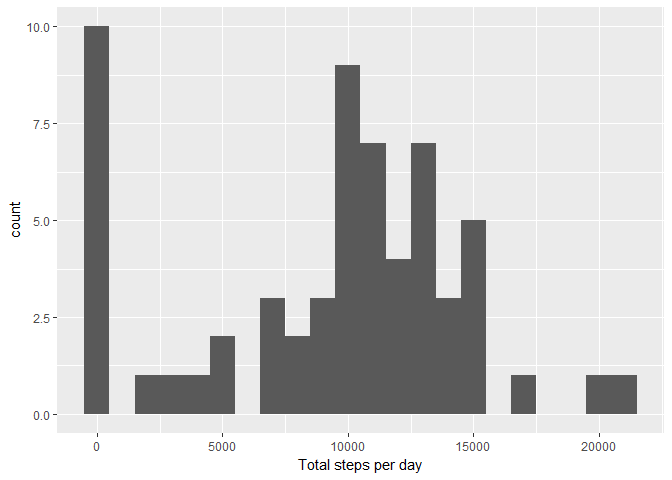
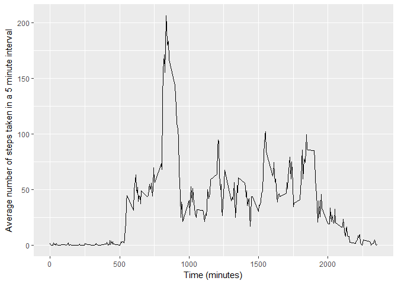
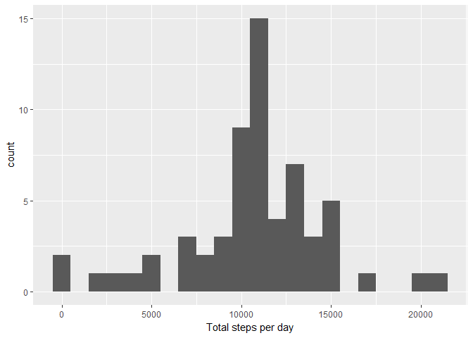
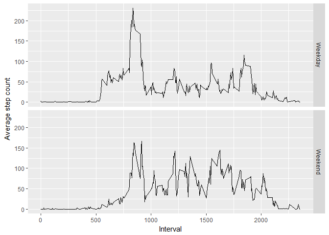

## Loading and preprocessing the data

```r
library(dplyr)
```

```
## 
## Attaching package: 'dplyr'
```

```
## The following objects are masked from 'package:stats':
## 
##     filter, lag
```

```
## The following objects are masked from 'package:base':
## 
##     intersect, setdiff, setequal, union
```

```r
library(ggplot2)

df <- read.csv("activity.csv")
```


## What is mean total number of steps taken per day?

```r
total_steps <- df %>% group_by(date) %>% 
                 summarise(total=sum(steps, na.rm=TRUE))
message(paste("Mean:", mean(total_steps$total)))
```

```
## Mean: 9354.22950819672
```

```r
message(paste("Median:", median(total_steps$total)))
```

```
## Median: 10395
```

```r
qplot(x=total, data=total_steps, geom="histogram", binwidth=1000, xlab="Total steps per day")
```

<!-- -->


## What is the average daily activity pattern?

```r
total_steps <- df %>% group_by(interval) %>% 
                 summarise(total=mean(steps, na.rm=TRUE))
qplot(x=interval, y=total, data=total_steps, geom="line", xlab="Time (minutes)", ylab="Average number of steps taken in a 5 minute interval")
```

<!-- -->

The 5 minute interval with largest average number of steps is interval 835:

```r
head(arrange(total_steps, -total), 1)
```

```
## # A tibble: 1 x 2
##   interval    total
##      <int>    <dbl>
## 1      835 206.1698
```


## Imputing missing values
There are 2304 rows containing missing values:

```r
nrow(df[!complete.cases(df),])
```

```
## [1] 2304
```

Replace the missing `step` values using the average for that interval:

```r
fill <- function(steps_value, interval_value) {
  if (is.na(steps_value))
    return(filter(total_steps, interval==interval_value)$total)
  return(steps_value)
}

# Calling data.frame ensures a new memory address is allocated
df_filled <- data.frame(df)
df_filled$steps <- mapply(fill, df$steps, df$interval)
```

Plot histogram:

```r
total_steps_filled <- df_filled %>% group_by(date) %>% 
                      summarise(total=sum(steps, na.rm=TRUE))
qplot(x=total, data=total_steps_filled, geom="histogram", binwidth=1000, xlab="Total steps per day")
```

<!-- -->

After filling in missing data, the mean and median both increase, suggesting that missing values are most likely to occur towards the middle of the day when the `step` count is higher on average:

```r
message(paste("Mean:", mean(total_steps_filled$total)))
```

```
## Mean: 10766.1886792453
```

```r
message(paste("Median:", median(total_steps_filled$total)))
```

```
## Median: 10766.1886792453
```


## Are there differences in activity patterns between weekdays and weekends?

```r
is_weekend <- function(day){
  if (day=='Saturday' | day=='Sunday')
    return('Weekend')
  return('Weekday')
}

df_filled$weekday <- weekdays(as.Date(df_filled$date))
df_filled$weekend <- sapply(df_filled$weekday, is_weekend)

total_steps <- df_filled %>% 
               group_by(interval, weekend) %>% 
               summarise(total=mean(steps, na.rm=TRUE))

a <- ggplot(total_steps, aes(interval, total))
a + geom_line() + facet_grid(weekend~.) + labs(x='Interval', y='Average step count')
```

<!-- -->

The peak step count is higher during the working week, and the peaks occur at approximately the same time both during the week and on weekends.

The average step count increases sharply on weekdays between the 500 and 600 intervals, whereas this is absent on weekends.
